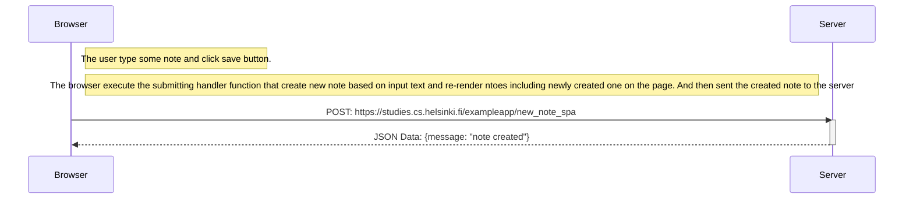

```mermaid
  sequenceDiagram
  participant Browser
  participant Server

  note right of Browser: The user type some note and click save button.

  note right of Browser: The browser execute the submitting handler function that create new note based on input text and re-render ntoes including newly created one on the page. And then sent the created note to the server

  Browser ->> Server: POST: https://studies.cs.helsinki.fi/exampleapp/new_note_spa
  activate Server
  Server -->> Browser: JSON Data: {message: "note created"}
  deactivate Server
```